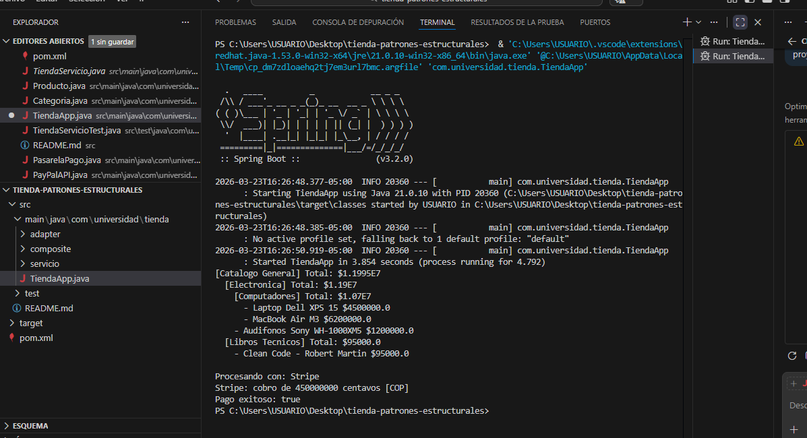
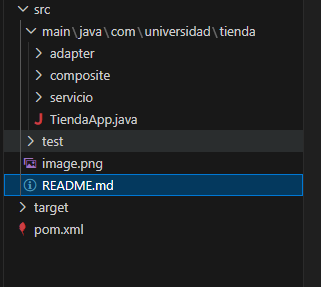
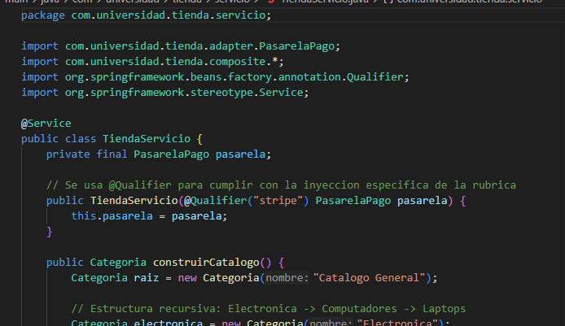

Proyecto: Integracion de Pasarelas de Pago y Catalogo Jerarquico
Unidad 3: Patrones Estructurales - Post-Contenido 1
Estudiante: Mauricio

Institucion: Universidad de Santander (UDES)

Programa: Ingenieria de Sistemas

1. Descripcion 
Este proyecto implementa una solucion de software utilizando Spring Boot para simular una tienda virtual. Se enfoca en resolver dos problemas estructurales comunes:

Integracion de APIs de terceros: Uso de pasarelas de pago externas con interfaces incompatibles.

Gestion de productos: Organizacion de un catalogo que contiene tanto productos individuales como categorias anidadas.

2. Patrones de Diseño Aplicados
Patron Adapter (Estructural)
Se implemento para que nuestra aplicacion pueda comunicarse con las APIs de PayPal y Stripe de forma transparente. Aunque ambas APIs tienen metodos y parametros distintos, el adaptador las normaliza bajo una misma interfaz interna.

Target (Interfaz): PasarelaPago

Adaptee (Clase Externa): PayPalAPI y StripeAPI

Adapter (Adaptador): PayPalAdapter y StripeAdapter

Patron Composite (Estructural)
Se utilizo para representar el catalogo de productos. Permite tratar a un producto individual y a una categoria de productos (que contiene otros productos o subcategorias) de la misma manera.

Component: ItemCatalogo

Composite: Categoria

3. Tecnologias y Conceptos Utilizados
Java 17: Lenguaje base del proyecto.

Spring Boot 3.2.0: Framework para la gestion de dependencias.

Inyeccion de Dependencias: Uso de @Qualifier para seleccionar la pasarela de pago en tiempo de ejecucion sin modificar el codigo fuente.

JUnit 5: Pruebas unitarias para validar la logica de los patrones

captures 
1) 

2) 

3) 

4) 
